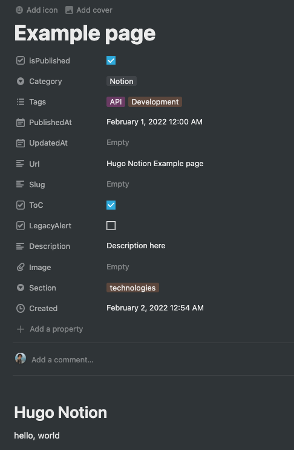

# Notion to Hugo Expoter

Use "Notion" as a Headless CMS to generate a content file for Hugo.

This software is dedicated to generating Markdown content for Hugo. After generating the content, follow the Hugo specifications.

## ⚠⚠Caution⚠⚠

The specifications are not flexible because it is intended for personal use.
If I find an OSS library that is easy to use in the future, I will use it.

## Usage

### Step 1. Prepare the command

Currently, this software is not published to the NPM registry.

Set up a link to your local environment.

```bash
git clone ...
npm install
npm link
```

### Step 2. Set environment

Set two environment variables to access the Notion.

```bash
NOTION_BLOG_DATABASE_ID=
NOTION_TOKEN=
# Notion tokens can be read-only role
```

### Step 3. Configuration

Create a config file.

```bash
cp notion-hugo.config.01sample.js hugo-notion.config.js

# Or if you need a custom process after downloading the image
cp notion-hugo.config.02callback-sample.js hugo-notion.config.js
```

#### Available Configuration Parameters

Below is the parameters that can be set configuration in `notion-hugo.config.js`

```js
module.exports = {
  directory: string,
  concurrency: number,
  saveAwsImageDirectory: null | string,
  downloadImageCallback: null | func(),
};
```

- `directory`: (Required) Directory for exporting pages. A directory is created for each section, but it is basically flat.
- `concurrency`: Defaults to `5`.
- `saveAwsImageDirectory`: Defaults to `null`. Images uploaded to Notion's pages are stored on Amazon S3, but the public URL has an 3600s limit. This is incompatible with generators that generate static HTML like Hugo. Therefore, you should upload it to some external storage and then embed the URL in the Notion's page. Enabling this option will make your work a little eaiser as the software will download the images.
- `downloadImageCallback`: Defaults to `null`. If you want to use the downloaded image for addition processing, you can implement a callback. For example, an example implementation for uploading an image to WordPress (using REST API) can be found in `notion-hugo.config.02callback-sample.js`

### Step 4. Run

Finally, exec command.

```bash
$ notion-hugo

 or

$ notion-hugo --force
```

This CLI is developed on Node v14.18.x

## Features

- Having a cache to reduce requests to the Notion API
- You can set the upper limit of parallel execution (according to the pLimit library)
- Stop the content generation process when you find an Amazon S3 image
- Amazon S3 Download the image when you find it (optional)
- Convert the string set in Url or Slug with kebab-case
- Implemented a callback that allows you to add arbitrary processing after downloading an image (see configuration)

## Example for exported contnet



### FrontMatter

```yml
---
sys:
  pageId: "01234567-0123-4567-8901-dummy1dummy2"
  createdTime: "2022-02-01T15:54:00.000Z"
  lastEditedTime: "2022-02-01T15:56:00.000Z"
title: "Example page"
date: "2022-02-01T00:00:00.000+09:00"
description: "Description here"
tags:
  - "API"
  - "Development"
categories:
  - "Notion"
toc: true
author: "Writer"
legacy_alert: false
draft: false
url: "/hugo-notion-example-page"
section: "technologies"
---
# Hugo Notion

hello, world
```

### Body

The Markdown body generated by thid program is heavily dependent on the "notion-to-md" library.

[souvikinator/notion-to-md: Convert notion pages, block and list of blocks to markdown (supports nesting)](https://github.com/souvikinator/notion-to-md)

## Caching

Cache the last modified date of a Notion's page with Notion's pageId as the primary key.

To minimize the number of request to the Notion API, we cache the date and time of the retrieved pages. Delete the `.notion-hugo-cache/` directory if you want to initialize it.

## Inspired by

This program is influenced by the design philosophy of the contentful-hugo library.

`contentful-hugo` is an easy-to-use library for generating Hugo content from Contentful CMS. Special thanks to @ModiiMedia

- [ModiiMedia/contentful-hugo: A CLI tool that pulls data from Contentful and turns it into markdown files for Hugo and other static site generators. It also includes an express server that can be used for local development and content previews](https://github.com/ModiiMedia/contentful-hugo)
